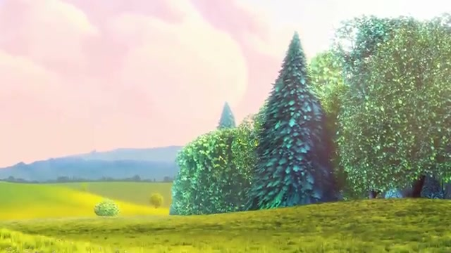
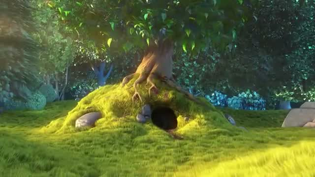

# Week 1 – Video Processing using FFmpeg

---

# Task 1 — Extract Frames from YouTube Video

## YouTube Video Used

https://www.youtube.com/watch?v=aqz-KE-bpKQ

## Download Command (Windows PowerShell)

```bash
yt-dlp -f mp4 -o video.mp4 "https://www.youtube.com/watch?v=aqz-KE-bpKQ"
```

## Extract Frames (1 frame per second)

```bash
ffmpeg -i video.mp4 -vf fps=1 frames/frame_%04d.jpg
```

## Output

Frames extracted successfully from the video.

### Sample Frames

(Add 2–3 images from sample_output folder here)

Example:





---

# Task 2 — Generate 1800 Frames & Recreate Video

## Extract 30 FPS Frames for 1 Minute

```bash
ffmpeg -i video.mp4 -t 60 -vf fps=30 frames_30fps/frame_%04d.jpg
```

Approx frames generated: **~1800 images**

## Convert Frames → Video

```bash
ffmpeg -framerate 30 -i frames_30fps/frame_%04d.jpg -c:v libx264 -pix_fmt yuv420p recreated_video.mp4
```

## Output Video

https://drive.google.com/file/d/1-AjRqV3xNVj71p8G9368O9oUHmON4j6j/view?usp=sharing

---

# Task 3 — Add Background Music to Video

## Music Source

P

## Trim Music to 1 Minute

```bash
ffmpeg -i music.mp3 -t 60 trimmed_music.mp3
```

## Merge Audio + Video

```bash
ffmpeg -i recreated_video.mp4 -i trimmed_music.mp3 -c:v copy -c:a aac final_video.mp4
```

## Final Video Output

https://drive.google.com/file/d/1L5CUNSAjvKB4lXA6WrKHLQmsllMP3iFA/view?usp=sharing


---

# Week 1 Summary

This week covered:

* Downloading YouTube videos using yt-dlp
* Extracting frames using FFmpeg
* Recreating video from image sequences
* Adding background music to video

These steps form the foundation for future object detection and segmentation tasks.
