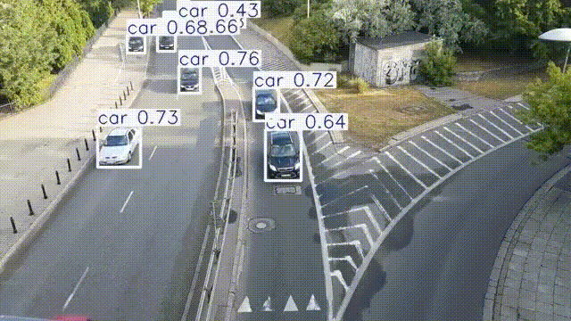

# WEEK 2 TASKS

Video used for this task: 
https://www.youtube.com/watch?v=MNn9qKG2UFI

---

## Task 1 — Install Ultralytics

```bash
pip install ultralytics
```

## Task 2 — Run YOLO Object Detection

Python script:

```python
from ultralytics import YOLO

model = YOLO("yolo11n.pt")  # pretrained model

results = model.predict(
    source="week 1/frames1_30fps",
    save=True,
    conf=0.25
)

print("Detection completed")
```

Output saved in:

```
runs/detect/predict/
```

---

## Extra step - Convert detected images → video

```bash
ffmpeg -framerate 30 -i runs/detect/predict/frame_%04d.jpg -c:v libx264 detected_video.mp4
```

## Add music

Music used:
https://pixabay.com/music/beats-background-hip-hop-music-for-video-vlogs-orchestral-beat-1-minute-154217/

### Trim music1.mp3
```bash
ffmpeg -i music1.mp3 -t 60 trimmed_music1.mp3
```

### Merge music1.mp3 and detected_video.mp3
```bash
ffmpeg -i detected_video.mp4 -i trimmed_music1.mp3 -c:v copy -c:a aac detected_video_with_audio.mp4
```
---

Output:

Detected video:



Final detected video:

